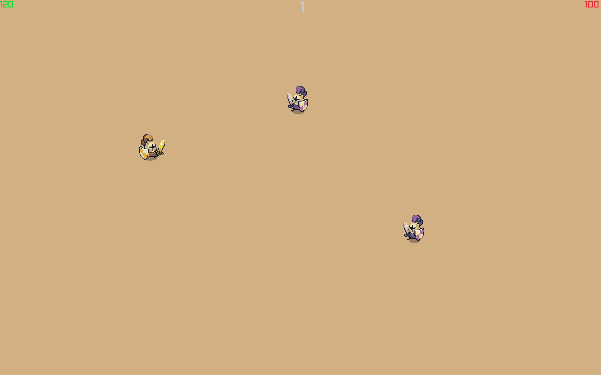

# Tiny-Swords
A top-down wave survival game built in C++ using raylib.


## Gameloop
- survive wave of enemy that spwan in increasing number everyround
- Player health regens every 3 rounds.

## Controls 
- WASD to move.
- left click to attack.

How many rounds can you survive ?? 

## Requirment
- C++17
- Raylib 

### Installing raylib
```bash
# Windows (vcpkg)
vcpkg install raylib

# macOS (Homebrew)
brew install raylib

# Ubuntu / Debian
sudo apt install libraylib-dev

# Fedora
sudo dnf install raylib-devel

```
## To run
```bash 
    make
    ./tiny-swords
```
## Credits
- [Pixel Frog](https://pixelfrog-assets.itch.io/)
- [Assets](https://pixelfrog-assets.itch.io/tiny-swords)
